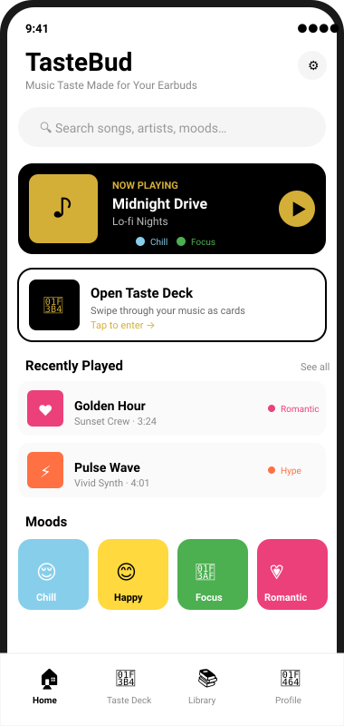
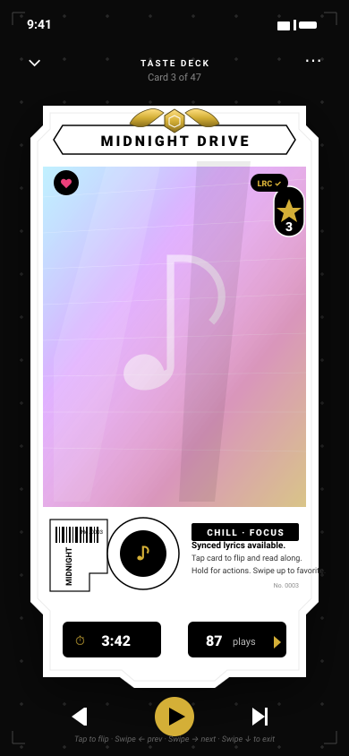
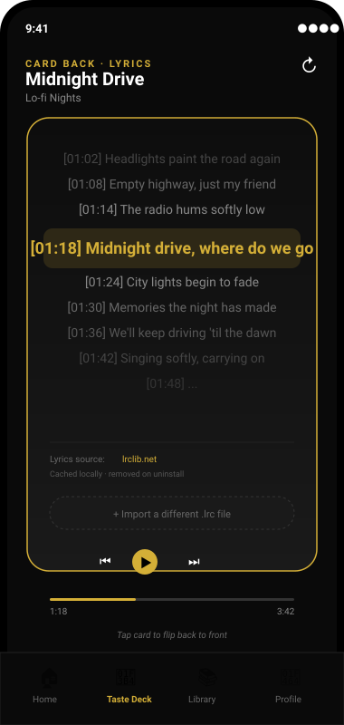
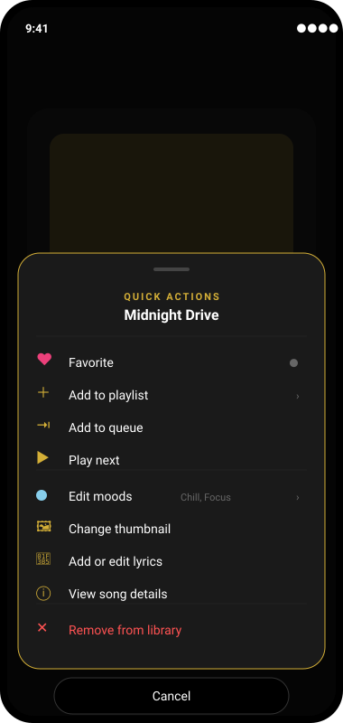

# TasteBud — UI Mockups

These are SVG mockups of the planned TasteBud screens. They are **design-phase artifacts** — not the final app. Use them to align on layout, gestures, and the 3-color theme before writing Flutter code.

All mockups use the **Default Premium** theme: white / black / gold (`#D4AF37`).

---

## 1. Home / Library

The layered home screen. Top to bottom: search → Now Playing card → Taste Deck shortcut → Recently Played → Moods grid → bottom nav.

**Notes:**
- Now Playing is always visible at the top while music is playing.
- Each library item shows a mood-colored dot for quick visual scanning.
- Tapping a song opens it in the Taste Deck (not a plain detail page).

---

## 2. Taste Deck — Card Front

The main player view. Each song is a card. Gestures:

- **Tap card** → flip to lyrics (see screen 3)
- **Swipe right** → next song
- **Swipe left** → previous song
- **Swipe up** → favorite
- **Swipe down** → return to home
- **Hold card** → quick action menu (see screen 4)

**Notes:**
- "LRC ✓" badge in the corner indicates synced lyrics are available.
- Heart icon on the album art shows favorite status.
- Mood chips are tappable to filter the deck to that mood.

---

## 3. Taste Deck — Card Back (Lyrics)

The flip-side of the card. Time-synced `.lrc` lyrics with the current line highlighted in gold.

**Notes:**
- Lyric source (`lrclib.net` in this example) is always attributed.
- "Cached locally · removed on uninstall" is the copyright safety message.
- If no lyrics exist, the card back shows an **Add Lyrics** button instead.

---

## 4. Quick Action Menu

Held-card menu. Bottom-sheet style.

**Notes:**
- Destructive action (Remove from library) is red and isolated at the bottom.
- "Edit moods" shows currently assigned moods inline.
- Items with chevrons (`›`) open sub-sheets (playlist picker, mood editor, etc.).

---

## Coming next

- 05 — Mood selector / chip editor
- 06 — Taste Profile Quiz (intro + question card)
- 07 — Theme picker (Default Premium / Night Deck / Soft Vinyl)
- 08 — Settings screen
- 09 — Playlist detail view
- 10 — Search results with mood filter

These will be added in the Design Phase as we lock down each module.
