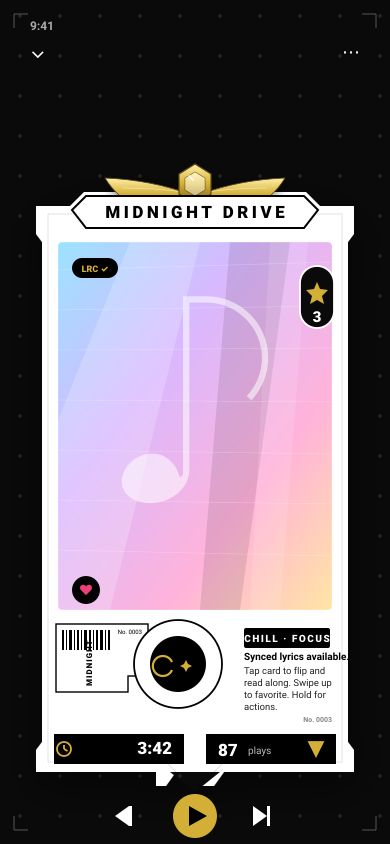
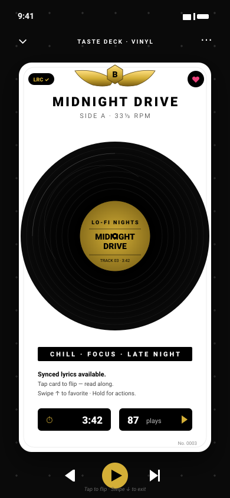
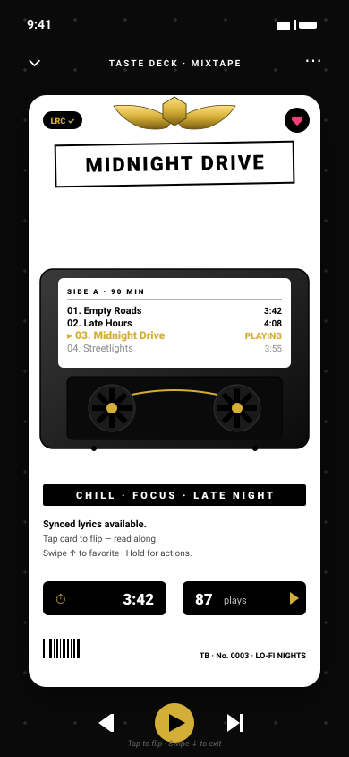
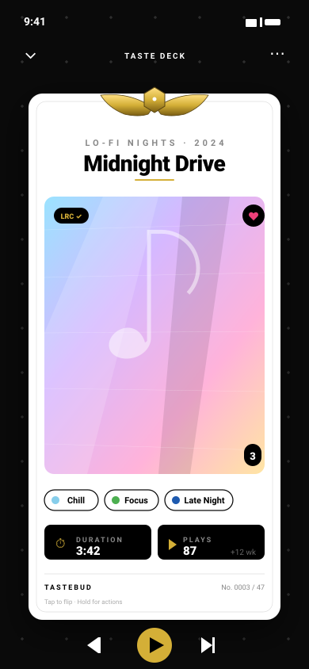

# Taste Deck — Card Style Variants

Four directions for the Taste Deck card aesthetic. Pick one to lock in, or mix elements from several.

## A — TCG (Closest to your reference)
Gold wing crest breaks the top edge. Notched silhouette. Holographic art window with foil streaks. Side barcode tab. Big dual stat pills at the bottom. **Most like the Lynae Vivian card.**

## B — Vinyl Record
Round vinyl record as the centerpiece, gold center label with song info. Card is rectangular and clean. Best fits the music identity but less "collectible card."

## C — Cassette / Mixtape
Cassette body with two spinning reels (Side A label shows the tracklist with the current song highlighted in gold). Slight off-axis title sticker for hand-made mixtape feel.

## D — Minimal Premium
Just typography, the gold crest, and a huge holographic art window. No banner, no notched silhouette. Subtle, magazine-cover style.

---

**Tell me:**
- Which variant feels closest, or
- Which elements to combine (e.g. "A's crest + D's typography + C's track-listing"), or
- What's still wrong — color/proportion/element/layout.
